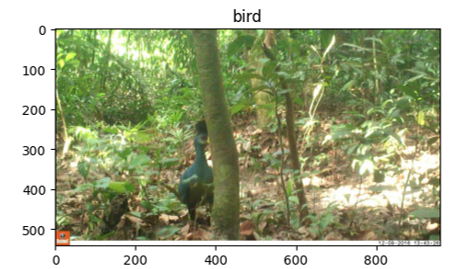
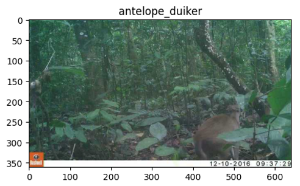

# Conser-Vision Image Classification: Exploratory Data Analysis

Camera traps are a tool used by conservationists to study and monitor a wide range of ecologies while limiting human interference. However, they also generate a vast amount of data that quickly exceeds the capacity of humans to sift through. Machine learning and advances in computer vision can help automate tasks such as species detection and identification, so that humans can spend more time learning from and protecting these ecologies and spend less time manually classifying animal species.

Using real-life images from the **Taï National Park in Côte d'Ivoire**, this project applies Transfer Learning to create an image detection model based on Convolutional Neural Networks (CNN) that is suitable for classifying 7 types of animal species.

The data was obtained from the website DriveData:

*The Pan African Programme: The Cultured Chimpanzee, Wild Chimpanzee Foundation, DrivenData. (2022). Conser-vision Practice Area: Image Classification. Retrieved July 2024 from https://www.drivendata.org/competitions/87/competition-image-classification-wildlife-conservation/.*

--- 

## Project overview

* Visual exploration of images with different species
* Exploring the overall and site-specific distribution of species
* Image transformation and augmentation
* Applying transfer learning with pre-trained Densenet models
* Evaluating training and validation metrics - accuracy, cross-entropy loss, recall, precision, F1-Score, ROC AUC (One-vs-Rest)

 

## Repository content
* **Visuals:** Contains graphs, visualisations and evaluation results
* Conser-Vision EDA (python notebook): Data exploration and visualisations
* Model Building (python notebook): Transfer Learning based on a pre-trained DenseNet201 model
* Model Building with Image Augmentation (python notebook): Transfer Learning based on a pre-trained DenseNet201 model and image augmentation techniques
* Python script with functions

 

## Resources used
* **Python version:** pyenv with python 3.11.3
* **EDA Packages**: pandas, numpy, matplotlib, seaborn
* **Deep Learning Packages**: Keras, Tensorflow, Scikit-Learn

---

## Dataset

The dataset contains over 16000 images with 7 different animals residing in the Taï National Park. The species are:

* Antelope Duiker
* Bird
* Civet Genet
* Hog
* Leopard
* Prosimian Monkey
* Rodent

In addition, the dataset contains images without any animals (Blank).

Here are a few examples:

 

Apart from the species, additional .csv files provide information about image IDs, identified species in each image (labels), and each image's site location ID.

## Exploring the data

This section of the project explores the data with respect to: 

* The distribution of the target variable - 7 species (plus a "blank" category)
* The distribution of sites 
* Number of unique sites each animal appears at

**Distribution of species**

This is an unbalanced dataset. Ideally, each species (plus the "blank" class) would appear in 12.5% of all images. Here, however, some species appear only ~6% of the time (hog), while others appear in over 15% of the images (prosimian monkey).

 

Some sites contain many more images than others. It is therefore possible that cameras at some of the less frequent locations observed only a smaller subset of species, which could skew model results later on.

 

Finally, the relationship between species and the number of unique sites was examined. Some species appear only in a small number of different locations, while others get around a lot. The former may potentially bias the model's learning. The model might specificially not recognize those species that frequent a small number of forest areas, but rather focus on the surroundings as a more significant input to identify those species.

The dataset was divided into a training and a validation set the following way:

* The split was stratified based on species so that the distribution is roughly the same in both datasets
* The split additionally divided sites in such a way to ensure that every site appears entirely in either the training or the validation set, but never in both. This was done so the model doesn't simply learn a location's features, but tries to focus on the animal's characteristics instead. 

