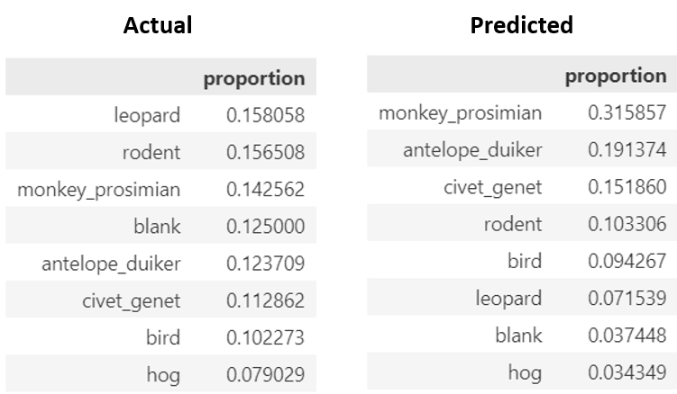

# Conser-Vision: Classifying Images of Wildlife Species

Camera traps are a tool used by conservationists to study and monitor a wide range of ecologies while limiting human interference. However, they also generate a vast amount of data that quickly exceeds the capacity of humans to sift through. Machine learning and advances in computer vision can help automate tasks such as species detection and identification, so that humans can spend more time learning from and protecting these ecologies and spend less time manually classifying animal species.

Using real-life images from the **Taï National Park in Côte d'Ivoire**, this project applies Transfer Learning to create an image detection model based on Convolutional Neural Networks (CNN) that is suitable for classifying 7 types of animal species.

 

The data was obtained from the DrivenData website:

*The Pan African Programme: The Cultured Chimpanzee, Wild Chimpanzee Foundation, DrivenData. (2022). Conser-vision Practice Area: Image Classification. Retrieved July 2024 from https://www.drivendata.org/competitions/87/competition-image-classification-wildlife-conservation/.*

--- 

## Project overview

* Visual exploration of images with different species
* Exploring the overall and site-specific distribution of species
* Image transformation and augmentation
* Applying transfer learning with pre-trained Densenet models
* Evaluating training and validation metrics - accuracy, cross-entropy loss, recall, precision, F1-Score, ROC AUC (One-vs-Rest)

 

## Repository content
* **Visuals:** Contains graphs, visualisations and evaluation results
* Conser-Vision EDA (python notebook): Data exploration and visualisations
* Model Building (python notebook): Transfer Learning based on a pre-trained DenseNet201 model
* Model Building with Image Augmentation (python notebook): Transfer Learning based on a pre-trained DenseNet201 model and image augmentation techniques
* Python script with functions

 

## Resources used
* **Python version:** pyenv with python 3.11.3
* **Cloud System**: Google Colab
* **EDA Packages**: pandas, numpy, matplotlib, seaborn
* **Deep Learning Packages**: Keras, Tensorflow, Scikit-Learn

---

## Dataset

The dataset contains over 16000 images with 7 different animals residing in the Taï National Park. The species are:

* Antelope Duiker
* Bird
* Civet Genet
* Hog
* Leopard
* Prosimian Monkey
* Rodent

In addition, the dataset contains images without any animals (Blank).

Here are a few examples:

 

Apart from the species, additional .csv files provide information about image IDs, identified species in each image (labels), and each image's site location ID.

## Exploring the data

This section of the project explores the data with respect to: 

* The distribution of the target variable - 7 species (plus a "blank" category)
* The distribution of sites 
* Number of unique sites each animal appears at

**Distribution of species**

This is an unbalanced dataset. Ideally, each species (plus the "blank" class) would appear in 12.5% of all images. Here, however, some species appear only ~6% of the time (hog), while others appear in over 15% of the images (prosimian monkey).

 

**Distribution of sites**

Some sites contain many more images than others. It is therefore possible that cameras at some of the less frequent locations observed only a smaller subset of species, which could skew model results later on.

 

**Variety of species' locations**

Some species appear only in a small number of different locations, while others get around a lot. The former may potentially bias the model's learning. The model might specificially not recognize the species that frequent a small number of forest areas, but rather focus on the surroundings as a more significant input for identifying those species.

The dataset was subsequently divided into a training and a validation set the following way:

* The split was stratified based on species so that the distribution is roughly the same in both datasets
* The split additionally divided sites in such a way to ensure that every site appears entirely in either the training or the validation set, but never in both. This was done so the model doesn't simply learn a location's features, but tries to focus on the animal's characteristics instead. 

 

## Image Augmentation

The location of animals in the images is rarely the same. They sometimes appear too far to the left or right, or are simply too close to the camera. Image transformation techniques help level the playing field by introducing different variations of images that an animal may appear in. This makes it easier for the model to make better predictions.

Here are some of the transformations that were applied:

* Rotation
* Shearing
* Shifts along the width and height
* Zooming in and out
* Different brightness levels
* Horizontal flip

Here is an example of how image transformations affect an image:

 

 

Moreover, image augmentations can be leveraged to balance out the distribution of species in the dataset. While the process does not necessarily increase the number of new data, it does introduce "new", augmented images randomly. The model sees these examples and is able to learn more robust features, ultimately leading to better generalizability of the model.

 

## Model Building with Transfer Learning

The model was build on top of a pre-trained DenseNet201 model. After the hyperparameter tuning step, the best model was built. It consisted of image augmentation layers (random rotation, zoom, etc.) and two dense layers with:

* a dropout layer
* batch normalization
* L2 kernel regularization
* a ReLU activation 

The model was optimized via RMSprop and a learning rate of 0.0005.

 

**Class weights**

In addition to image augmentation, weights were applied to under-represented species in the dataset to make the model pay more attention to them during training: 

${weight_i} = \left(\frac{1}{\text{number of images in class {i}}}\right) \times \left(\frac{\text{total number of images}}{\text{number of classes}}\right)$

 

**Evaluation metrics**

Since choosing the right metric depends on project goals, different classification metrics - **Accuracy, Recall, Precision, F1-Score and ROC AUC** - were used to evaluate model performance in this case.

 

### Model performance

Overall, at a 41% accuracy on the validation set, the model with image augmentation did not do a great job at classifying the species correctly.

In terms of Categorical Cross-Entropy loss, the validation score was much closer to the training dataset. Both sets, however, cannot boast a very low loss (2.1 for the validation set).

 

**Distribution of target variable classes and Confusion matrix**

 

Many more images were classified as the prosimian monkey than is actually the case. Conversely, there are barely any blank images in the predictions, which might be a hint that the model did not focus on the species during the training phase, but attributed the final prediction to the environment much more than it did to the animal itself. Since the prosimian monkey was found at most unique camera trap sites, it makes sense that the model confused blank sites with the monkey.

Also, a lot of birds and antelopes were predicted to be the prosimian monkey. In contrast to birds, antelopes are well represented in the dataset. Still, the model did not do a great job at detecting them. It is possible that antelopes and monkeys appear at similar times of the day and in similar settings, which is why the model frequently confused them. This result also suggests that it did not focus sufficiently on the characteristics of the species itself, but more on its surroundings.

 

**Classification Report**

 

Relatively high **recall rates** can be observed for the **civet genets (63%)** and **prosimian monkeys (73%)**. This means that the model was very good at recognizing these two species as themselves and not as something else. 

On the other hand, not many species were predicted to be a **leopard**, leading to a high **precision rate (85%)**. Considering that leopards have quite unique patterns and colors, the model did not confuse many species for it.

The recall rate of the least represented species in the dataset - **birds and hogs** - are very low (**17% and 22%, respectively**). This means that the model did not do a good job at focusing its attention on those specific cases where these two species appear, as is evident in the confusion matrix above.

 

**ROC AUC**

The **civet genet, prosimian monkeys and leopard** have the highest AUC scores. This is reflected in the shape of their ROC curves as well as the high recall and precision and moderate F1-scores (compared to other classes).

Because it has learned some clear patterns from certain images, the model can be said to perform well with the following species:

* Civet genets (**F1-Score: 0.54 and AUC: 0.91**)
* Leopards (**F1-Score: 0.53 and AUC: 0.84**)
* Prosimian monkeys (**F1-Score: 0.46 and AUC: 0.83**)

Unforunately, for all the other species, the model performs rather poorly. One of the reasons might be the fact that some of the species are small in comparison and/or only appear at night. Another reason is, as highlighted above, the fact that the model focused too much attention on the surroundings rather than the animal itself.

Finally, here are a few examples of how the model classified the species in the validation set:

 

## Productionization

In order to make this a viable product, a much better F1-Score and accuracy score will need to be achieved.

The next step should involve better image preprocessing, including augmentation techniques such as zooming, rotating, shearing and brightness levels. Experimenting with these aspects and applying them to the images should produce a model that is much better at identifying diverse types of species in a forest/jungle setting.